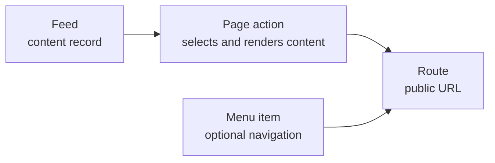

# Administrator Guide: Content, pages, and routing

This chapter explains how content becomes a public URL in Stream Engine. Use
it after completing the
[initial configuration](https://github.com/bfhp/stream-engine/wiki/Administrator-Configuration).

Make structural changes on a staging site first. A page-tree error can prevent
normal requests from starting, so take a current database backup before
changing an established site's routes.

## The four parts of a public page

Stream Engine separates content from the URL and navigation that expose it:

- A **feed** is a content record. It has a type, title, slug, body, optional
  parent, visibility, image, and ordering position.
- A **page** is a node in the public routing tree. Its pattern and parent
  determine a URL segment, while its action determines which module renders
  the request.
- A **page action** is supplied by an enabled module. It defines which feed or
  other fields are required. The page editor displays and validates that
  contract.
- A **menu item** is an optional link. It does not create a route and its
  access setting is not a security boundary.

Saving a feed alone does not guarantee that it has a public URL. Saving a menu
item alone does not create a page. The route must exist, its page action must
be configured correctly, and both the page and the selected content must
allow the visitor to access them.

## Before editing content

Sign in as an administrator and open **Administration**. The relevant areas
are **Feeds**, **Pages**, and **Menus**.

Before a route change:

1. record the current page ID, parent, pattern, action, feed fields, access,
   and menu items that reference it;
2. save a database backup;
3. test the proposed URL while signed in and in a private browser window;
4. plan redirects for any public URL that will move; and
5. make one structural change at a time.

The administration interface has no redirect manager. Configure permanent
redirects in the reverse proxy or web server before moving a URL that visitors
or search engines may already know.

## Manage feeds

Open **Administration > Feeds** to find content records. You can filter by
type, ID, slug, owner ID, or parent ID. The default view is limited to 100
newest records; use a narrow filter instead of assuming that an absent record
does not exist.

### Feed fields

| Field | Meaning |
| --- | --- |
| Title | Human-readable content title. |
| Type | Content contract supplied by a module, such as `article` or `article-section`. Choose the type before connecting the feed to a page action. |
| Slug | URL-safe name used by dynamic routes. Keep it stable and unique within the relevant parent and type. Use short lowercase words separated by hyphens. |
| Parent ID | Optional feed hierarchy. This is a feed ID, not a page ID. Dynamic article routes use it to keep content in the same hierarchy as the page route. |
| Visibility | Content-level access: `public`, `members`, or `private`. See [Access has three layers](#access-has-three-layers). |
| Position | Non-negative ordering value used by parent-based listings; lower values sort first where the listing supports position order. |
| Description | Summary used by supported views and metadata. |
| Image URL | Existing image URL. The upload button beside the content editor inserts an uploaded image into the body instead of filling this field. |
| Content | Sanitized HTML body edited in the source editor. Preview the result in the active theme after saving. |

After creation, the browser address changes to `/admin/feeds/ID`. Record that
ID, or read it from the Feeds list, when a page action needs a fixed **Feed
ID** or another feed needs this record as its parent.

> [!CAUTION]
> The generic feed editor does not currently provide a delete operation.
> Do not delete feed rows directly from MariaDB: related content and cached
> URLs may depend on them. Restrict access while deciding on a supported
> content-removal workflow.

## Understand the page tree

Open **Administration > Pages** to see the routing table in hierarchy order.
Page ID `1` is the root page at `/`. Its pattern and parent cannot be changed,
and it cannot be deleted.

Every other page requires a parent. The public path is built from its ancestor
patterns. For example:

| Parent path | Child pattern | Resulting path |
| --- | --- | --- |
| `/` | `about` | `/about/` |
| `/` | `articles` | `/articles/` |
| `/articles/` | `{slug}` | `/articles/{slug}/` |

A static pattern is literal. A dynamic pattern contains a placeholder such as
`{slug}`. Stream Engine also supports a constrained placeholder such as
`{id:\d+}`, but administrators should use only a pattern required by the
selected module's documented route. An invalid regular expression can break
request startup.

Static siblings take precedence over a dynamic sibling. If `/profile/` and
`/{slug}/` share the root parent, `/profile/` reaches the static page and an
otherwise unmatched segment can reach the dynamic page.

### Route rules that must remain true

- Page IDs must be unique.
- Every non-root page must reference an existing parent.
- A page cannot be its own parent or a child of one of its descendants.
- Static sibling patterns must be unique.
- Only one dynamic sibling pattern is allowed under a given parent.
- Page action names must remain unique in the complete runtime page tree.

The editor prevents invalid parent cycles and validates action-specific fields.
The current release does not reject every duplicate pattern or duplicate
action before writing it to the database. The runtime validates the complete
tree on the next request and may fail to start if a conflict was saved.
Always search the Pages list for the intended pattern and action before
creating a page, and keep the database backup until the site has passed its
post-change checks.

## Configure a page action

Select the action first. The editor then marks **Feed ID**, **Feed type**,
**List feed type**, and **Term vocabulary** as required, optional, fixed, or
unused for that action. Clear values reported as unsupported. Do not copy
field combinations from a different action.

Common article actions are:

| Action | Use |
| --- | --- |
| `article.show-id` | Render one fixed `article` selected by Feed ID. The installed root page uses this action for the welcome article. |
| `article.show-slug` | Render an `article` selected from a `{slug}` route. Feed type is fixed to `article`. |
| `articles.list` | Resolve an `article-section` from the route and list its child `article` feeds. |
| `sections.list` | List `article-section` children under a fixed root Feed ID. |

Other enabled modules add their own actions. Use the descriptions and field
validation shown by the editor; unavailable legacy actions may be preserved
on an existing page but cannot be selected for a new one.

**Page name** supplies a fallback display name. **Article content width** is
available for article display actions. **Show comments** and **Show share
buttons** affect only views and themes that support those features.

## Worked example: publish `/about/`

This example creates one reusable dynamic article route, publishes an About
article through it, and adds a navigation link. Perform it on a new or staging
installation first.

### 1. Find the content root

1. Open **Administration > Pages**.
2. Find page `#1`, the root page.
3. Record the Feed ID displayed for it. Call this value `ROOT_FEED_ID` in the
   following steps.
4. Search the page list for action `article.show-slug`.

If that action already exists, do not create another page with the same
action. Inspect the existing page and use the parent feed and URL hierarchy it
defines.

### 2. Create the article feed

Open **Administration > Feeds > New feed** and enter:

| Field | Value |
| --- | --- |
| Title | `About` |
| Type | `article` |
| Slug | `about` |
| Parent ID | `ROOT_FEED_ID` |
| Visibility | `public` |
| Position | `0` or the desired order among sibling articles |
| Description | A short public summary |
| Content | The About page body as valid HTML |

Save the feed. Confirm that it now has an ID and remains attached to the
expected parent. The parent matters: `article.show-slug` resolves the article
inside the feed hierarchy anchored by the nearest ancestor page.

### 3. Create the dynamic page once

Skip this step if the required `article.show-slug` page already exists.
Otherwise, open **Administration > Pages > New page** and enter:

| Field | Value |
| --- | --- |
| Pattern | `{slug}` |
| Action | `article.show-slug` |
| Page name | `Article` |
| Parent ID | `#1`, the root page |
| Feed type | `article` (filled or restricted by the action contract) |
| List feed type | empty |
| Term vocabulary | empty |
| Feed ID | empty |
| Change frequency | `monthly` |
| Access | `public` |

Choose the desired content width, comments, and share buttons, then save. Do
not enter the About feed ID: this route selects articles by slug and can serve
all public `article` children of `ROOT_FEED_ID`.

### 4. Verify the URL before adding navigation

Open `https://example.com/about/`, replacing the host with the site's
canonical host. Confirm all of the following:

- the request returns the About article rather than a 404 or another page;
- the title, description, body, and images render correctly;
- the canonical URL uses the expected HTTPS host and path;
- comments and share controls match the page settings; and
- the same URL works in a private browser window.

Also revisit existing top-level URLs. The static routes should still win over
`{slug}`, but this smoke test detects a misplaced parent or conflicting route.

### 5. Add navigation

Open **Administration > Menus > New menu item** and enter:

| Field | Value |
| --- | --- |
| Menu group | `top` |
| Type | `external` |
| Label | `About` |
| Parent item | empty for a top-level item, or the desired item in the same group |
| URL | `/about/` |
| Access | `public` |
| Enabled | on |

The relative URL keeps the link on the canonical site. This example uses the
`external` menu type because the target page is dynamic and the menu editor
cannot bind the fixed `about` slug to an `internal` page reference. Save the
item, inspect the menu preview, then open the public site and test the link.

Further articles need only another `article` feed under `ROOT_FEED_ID` with a
unique slug. They reuse the same `{slug}` page. Add a menu item only when that
article belongs in persistent navigation.

## Access has three layers

Access must be considered separately at each layer:

1. **Page access** gates the route: `public`, `authenticated`, `moderator`, or
   `admin`.
2. **Feed visibility** gates the selected content: `public`, `members`, or
   `private`, with owner and administrator overrides.
3. **Menu access** controls whether a navigation item is displayed.

Hiding a menu item does not protect its URL. Set the page access rule and feed
visibility first, then give the menu item the same or a stricter audience.

`members` and `private` visibility depend on membership in a content container.
For a generic global feed without a container, they do not mean “all signed-in
users” and may leave the item available only to its owner and administrators.
Use `public` for the worked example. User, moderator, ownership, and community
rules are covered in the next administrator chapter.

## Sitemap settings and current limits

**Change frequency** is a search-engine hint, not a publishing schedule and
not a cache lifetime. Use a realistic value. `never` still permits a sitemap
entry; it tells crawlers that the URL is not expected to change.

In the current release:

- a public static HTML page is included in `sitemap-pages.xml` unless its
  value is `noindex`;
- a public dynamic page with a feed type enables feed sitemap entries for that
  type;
- dynamic feed sitemap entries use the feed update time and do not include the
  page's change-frequency value; and
- `noindex` on a page controls generated sitemap inclusion only where the
  sitemap implementation checks it. It does not by itself guarantee a
  `robots` meta tag or HTTP header.

If exclusion from search engines is mandatory, verify the rendered response
and apply an appropriate reverse-proxy header or theme-level robots directive
in addition to checking the generated sitemap. Do not rely on the field label
alone.

The generated sitemap index is available at `/sitemap-index.xml` and is
advertised through `/robots.txt`. After publishing, verify both endpoints and
search the relevant sitemap for the expected canonical URL.

## Change or remove a route safely

Changing a page pattern or parent changes its URL and the paths of its
descendants. Changing a feed slug changes a dynamic URL. Before either change:

1. inventory inbound menu links and known external links;
2. create the replacement route and web-server redirect plan;
3. make the change during a maintenance window;
4. test as every intended audience; and
5. verify canonical links, menus, and sitemaps.

Feed canonical URLs are cached in Memcached for up to 24 hours. A route or
slug change can therefore leave an old canonical URL in rendered content or a
sitemap until that entry expires. Do not flush a shared Memcached service
indiscriminately; it may affect other applications or Stream Engine sites.

To delete a page, remove or repoint menu items that reference it and delete
its child pages first. The root page cannot be deleted. Page deletion is
immediate and cannot be undone through the interface, so retain the database
backup until verification is complete.

## Post-change checklist

- The intended URL works with and without a trailing slash as expected by the
  web-server configuration.
- Static sibling URLs still resolve correctly.
- Guests and each required signed-in role receive the intended response.
- Content visibility agrees with page and menu access.
- Canonical URLs use `SITE_URL` and HTTPS.
- Menus show the correct label and target to the correct audience.
- `/sitemap-index.xml` and the relevant child sitemap are valid.
- Application and PHP-FPM logs contain no page-tree, route-regex, action, or
  missing-feed errors.
- The rollback backup and old route details are retained until monitoring
  shows normal traffic.

[Back: Initial configuration](https://github.com/bfhp/stream-engine/wiki/Administrator-Configuration) · [Next: Users and permissions](https://github.com/bfhp/stream-engine/wiki/Administrator-Users-and-Permissions)
