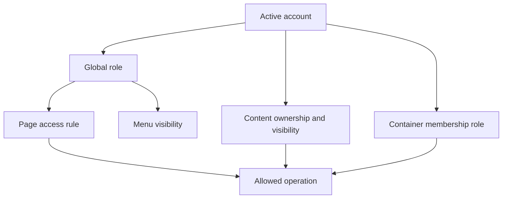

# Administrator Guide: Users and permissions

This chapter explains how to operate user accounts and assign access without
confusing global site roles with content ownership or community membership.
Complete it after
[Content, pages, and routing](https://github.com/bfhp/stream-engine/wiki/Administrator-Content-and-Routing).

Test every privilege change with a separate account. Keep at least two active
administrator accounts on an operational site so one administrator can recover
the other without editing the database.

## Permission model

Stream Engine makes access decisions from several independent properties:

An account can therefore be a global site moderator without moderating a
particular community, or own a community while retaining the normal global
`user` role. A visible menu item does not grant access, and a hidden menu item
does not protect its URL.

## Global account roles

Every human account has one global role:

| Role | Site-wide meaning |
| --- | --- |
| `user` | Normal authenticated account. It can reach pages marked `authenticated` and perform operations granted by ownership or membership. |
| `moderator` | Includes normal-user access and can reach pages and menu items marked `moderator`. It does not grant access to Administration and does not automatically make the account a moderator or owner of every community. |
| `admin` | Grants access to Administration, satisfies all page audience rules, and overrides feed visibility and feed edit checks. Assign it only to trusted site operators. |

Modules may apply additional ownership or membership checks after the route
has admitted a user. A page access rule alone cannot express “the owner of
this specific community”, so never infer write access only from the page's
audience.

## Active and inactive accounts

The **Active** status is independent of the global role.

An active account can authenticate and appear in public user lookups according
to the relevant feature. An inactive account cannot sign in. When an
administrator deactivates an account, Stream Engine deletes all of that
account's current sessions immediately. Reactivation does not restore those
sessions; the user must sign in again.

Deactivation does not delete the user, their feeds, messages, uploads,
memberships, or ownership records. Use it as the reversible administrative
response when access must be stopped. The current administration interface
does not provide account deletion.

New registration behaves according to **Administration → Registration**:

- **Open registration** creates an active account immediately.
- **Email confirmation** creates an inactive account and sends a confirmation
  link that is valid for 24 hours.
- **Closed** prevents public account creation.

The hourly `users:cleanup` task removes an unfinished inactive registration
after its verification token expires. It does not remove an established
account that an administrator later deactivated, because that account no
longer has a pending verification record. Registration and CAPTCHA setup are
covered in
[Initial configuration](https://github.com/bfhp/stream-engine/wiki/Administrator-Configuration#registration-policy).

## Find and review accounts

Open **Administration → Users**. The catalogue includes active and inactive
accounts and is available only to administrators.

The list shows 25 accounts per page, newest first. Search matches email,
display name, or username; a numeric search can also match an exact user ID.
Use the role and status filters together when reviewing privileged or inactive
accounts.

For a routine privilege review:

1. filter by **Administrator** and confirm that every account still belongs to
   a current site operator;
2. filter by **Moderator** and confirm that each account still needs global
   moderator pages;
3. filter by **Inactive** and distinguish unfinished registrations from
   deliberately disabled established accounts; and
4. record the review date and decisions outside Stream Engine, because the
   current user editor does not expose a privilege-change audit log.

## Edit account identity

Select the edit control beside an account. The editor can change:

| Field | Rule and consequence |
| --- | --- |
| Email | Must be a valid, unique address no longer than 255 characters. It is the login name and password-recovery destination. An administrator change does not send a new verification message. |
| Display name | Optional public name, up to 50 characters. An empty value falls back to an ID-based display in some views. |
| Username | Required when saving through the administrator editor. It must be 3–30 ASCII characters, start with a letter or digit, and contain only letters, digits, `_`, or `-`. It must be unique. |
| Role | `user`, `moderator`, or `admin`. Changing it requires confirmation. |
| Active | Enables or disables authentication. Changing it requires confirmation. |

An account created by registration may not yet have a username. Assign a
valid unique username before saving any other change to that account.

Changing a username changes username-based public profile URLs and may break
bookmarks or external links. The application has no profile-redirect manager.
Changing an email changes the next login credential and future recovery
destination. Verify both changes with the account owner before saving them.

The user editor does not change passwords. Direct the account owner to the
public **Forgot password** flow. A password-reset link is valid for one hour
and is sent only when SMTP and `SITE_URL` are correctly configured.

## Protected accounts and safeguards

### System account

User ID `1` is the reserved system account. Stream Engine uses it as a stable
actor for system-owned content and notifications. It cannot start a user
session and cannot be edited in Administration. Do not change or delete it
directly in MariaDB.

### Current administrator

An administrator may edit their own email, display name, and username, but
cannot change their own role or active status. This prevents accidental
self-demotion and immediate self-lockout. Another administrator must make
those privilege changes.

When changing your own email, verify the new address and keep the current
session open until another private browser session can sign in with it.

### Last active administrator

Stream Engine refuses to deactivate or demote the last active administrator.
The safeguard counts only accounts that are both active and assigned the
`admin` role.

Before demoting or deactivating an administrator:

1. confirm that another account is active and has the `admin` role;
2. use a separate private browser session to sign in as that account;
3. open `/admin/` and perform a harmless read operation;
4. make the intended change from the other administrator session; and
5. confirm that the changed account now receives the expected access result.

Do not bypass these safeguards with direct SQL. A database change can leave
the site without a usable administrator and does not apply the session cleanup
performed by the application.

## Create or promote an administrator

The current Users page cannot create accounts. To add an administrator:

1. have the person create a normal account through the configured registration
   flow;
2. if registration is normally closed, use a controlled email-confirmation
   registration window and restore the closed policy immediately afterward;
3. confirm the account's email ownership and active status;
4. assign a valid username if it does not have one;
5. edit the account, change **Role** to `admin`, and accept the privilege
   confirmation;
6. have the new administrator sign in separately and verify `/admin/`; and
7. record who approved the access and when.

Do not share an administrator account. Separate accounts preserve ownership
and make later removal of access safer.

Use the same workflow with role `moderator` when an account only needs pages
explicitly intended for global moderators. Do not grant `admin` merely to let
someone moderate one community.

## Suspend and recover an account

For a suspected compromised or abandoned account:

1. locate it by ID, username, or email;
2. switch **Active** off and confirm the change;
3. verify that an existing session can no longer load an authenticated page;
4. investigate ownership, community responsibilities, and recent activity;
5. have the verified owner complete the public password-recovery flow; and
6. reactivate the account only after the recovery destination and role have
   been confirmed.

Changing identity fields does not change the password. Changing the role does
not deactivate the account. Use the active switch when immediate session
revocation is required.

If a deactivated account owns operational content or a community, do not
delete or reassign database rows manually. Keep it inactive while planning a
supported ownership transition. The current community interface does not
provide community ownership transfer.

## Page and menu access rules

Pages and menu items share four audience values:

| Access | Guest | Active `user` | Global `moderator` | `admin` |
| --- | --- | --- | --- | --- |
| `public` | allowed | allowed | allowed | allowed |
| `authenticated` | denied | allowed | allowed | allowed |
| `moderator` | denied | denied | allowed | allowed |
| `admin` | denied | denied | denied | allowed |

Use the access value on the page as the security boundary. Give its menu item
the same or a stricter value so users are not offered a link they cannot open.
The menu value only controls navigation display.

After changing an access rule, test the direct URL as a guest, normal user,
moderator, and administrator where applicable. Removing a menu link is not an
access test.

## Feed visibility and ownership

Content access is evaluated after page access:

| Feed visibility | Who can read it |
| --- | --- |
| `public` | Everyone who can reach the page. |
| `members` | The feed or container owner, administrators, and accepted members of its container. |
| `private` | The feed or container owner, administrators, and local container moderators or owners. |

For a generic feed with no container, non-public visibility leaves access to
the feed owner and administrators; it does not mean every authenticated user
or every global moderator.

Ownership can grant content access and editing even when the owner's global
role is `user`. Administrators override feed visibility and feed edit checks.
A local container moderator may edit content in that container, but a global
`moderator` does not automatically receive that local capability.

## Community membership roles

Community roles are local to one community and are separate from global
account roles:

| Local role | Level | Meaning |
| --- | ---: | --- |
| Subscriber | 0 | Pending request in an approval-based community. Not an accepted member and cannot post. |
| Member | 1 | Accepted member; can read members-only content and publish where the community feature permits. |
| Moderator | 2 | Includes member capabilities and can read or edit private content in that community. |
| Owner | 3 | Creator and administrative owner of that community. |

An open community grants member status immediately when a user joins. An
approval-based community creates a pending subscriber. The community owner can
open **Manage > Members** to accept pending subscribers. Removing an accepted
member from that screen demotes the account back to pending subscriber; it
does not delete the account or membership row. The owner cannot remove
themselves.

Only the community owner can open the current Manage page, approve requests,
remove members, or change the community's membership policy. Switching from
approval to open membership asks for confirmation and then promotes all
pending subscribers.

The data model includes a local moderator role and existing moderators are
honoured, but the current interface does not provide a supported control for
promoting a member to local moderator or transferring community ownership.
Do not implement either operation with direct database edits.

## Permission-change checklist

- [ ] The target account ID and owner were confirmed independently.
- [ ] The requested global role is the least privilege needed.
- [ ] Community responsibility was handled with local membership, not an
      unnecessary global administrator role.
- [ ] Another active administrator was tested before an administrator was
      demoted or deactivated.
- [ ] Deactivation terminated existing sessions.
- [ ] Direct page URLs were tested for every affected audience.
- [ ] Page and menu access values agree.
- [ ] Feed visibility and ownership produce the intended result.
- [ ] Username or email changes were communicated to the account owner.
- [ ] The operator, reason, and time of the change were recorded externally.

[Back: Content, pages, and routing](https://github.com/bfhp/stream-engine/wiki/Administrator-Content-and-Routing) · [Administrator Guide](https://github.com/bfhp/stream-engine/wiki/Administrator-Guide) · [Next: Appearance, navigation, and files](https://github.com/bfhp/stream-engine/wiki/Administrator-Appearance-and-Files)
